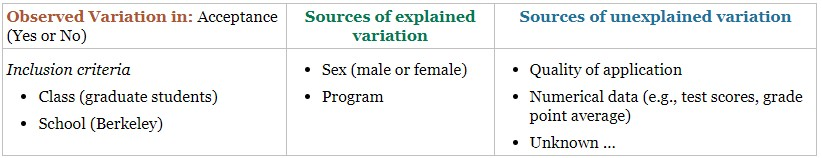

```{r setup, include=FALSE}
knitr::opts_chunk$set(echo = TRUE)
```

## Exploring the Berkeley Grad School Dataset

```{r grad, include=FALSE}
library(tidyverse)
library(vcd)
library(table1)
# library(ggmosaic)

grad <- read_csv("https://raw.githubusercontent.com/jkstarling/MA376/main/Berkeley.csv")
```

### Explore the Berkeley Data set

Let's take a look at the data:

```{r glimpse}
view(grad)

summary(grad)

glimpse(grad)

table(grad$Program)
table(grad$Sex)
table(grad$Accepted)
table(grad$Program, grad$Accepted)
```


**Observational units:** 

**Variables**

+ **Response variable:** 
\vspace{1in}

+ **Explanatory variables:**
\vspace{1in}

Let's change the variables to be categorical:

```{r}
grad2 <- grad %>% mutate(Program = as.factor(Program)) %>% 
         mutate(Sex = as.factor(Sex)) %>% 
         mutate(Accepted = as.factor(Accepted))
```

### Create a bar plot of accepted vs rejected.

```{r}
acc2 <- grad2 %>% pull(Accepted) %>% 
  fct_count() %>% 
  mutate(perc = n / nrow(grad2))

acc2 %>% ggplot(aes(x=f)) + 
  geom_bar(aes(y=perc),stat="identity") +
  labs(x="Accepted", y ="perc. of students")

```

What do we see here? 
\vspace{1in}


### Create a Contingency Table

We can ask the question, "Is the admissions process at Berkeley fair?". Or a more focused question, "Does the admissions process at Berkeley disproportionately affect women applicants?"

```{r echo=FALSE}
table1(~Accepted | Sex, data=grad2)
```

What do we see here?
\vspace{1in}

### Create Mosaic plot


Create a mosaic plot to see the data related to sex and acceptance: 
\vspace{1in}
```{r}
mosaic(~Sex+Accepted, data = grad2, highlighting="Accepted", highlighting_fill = c("lightblue", "lightgreen"), direction = c("v","h"))
```

What does this plot tell us? Are sex and acceptance *associated*?
\vspace{1in}


Does the program a person applied to make a difference? To explore this, we will condition on the program applied to:
```{r}


```
\vspace{1in}

What does this plot tell us? Is program associated with acceptance? How is this different than the previous plot?
\vspace{1in}


Here we look at the association between acceptance and program, conditioned on sex: 
\vspace{1in}
```{r}

```

What do we notice here compared to our first mosaic plot above? 
\vspace{1in}


What can we say about our original question, "Does the admissions process at Berkeley disproportionately affect women applicants?"? What do we call the variable *program*? 
\vspace{1in}


### Sources of Variation Diagram

On p. 8, the author provides the Sources of Variation diagram shown here. 

<center>
{width=6in}
</center>

Are there other sources to consider? 

\vspace{1in}

Six Steps of a statistical investigation:

- Ask a Research Question
\vspace{0.2in}

- Design a study and collect data
\vspace{0.2in}

-  Explore the data
\vspace{0.2in}

-  Draw inferences beyond the data
\vspace{0.2in}

-  Formulate conclusions
\vspace{0.2in}

-  Look back and ahead
\vspace{0.2in}


Did we do this with the Berkeley Data? What would you tell the college administration?

\vspace{0.4in}

Can we create a statistical model for the Berkeley data?


